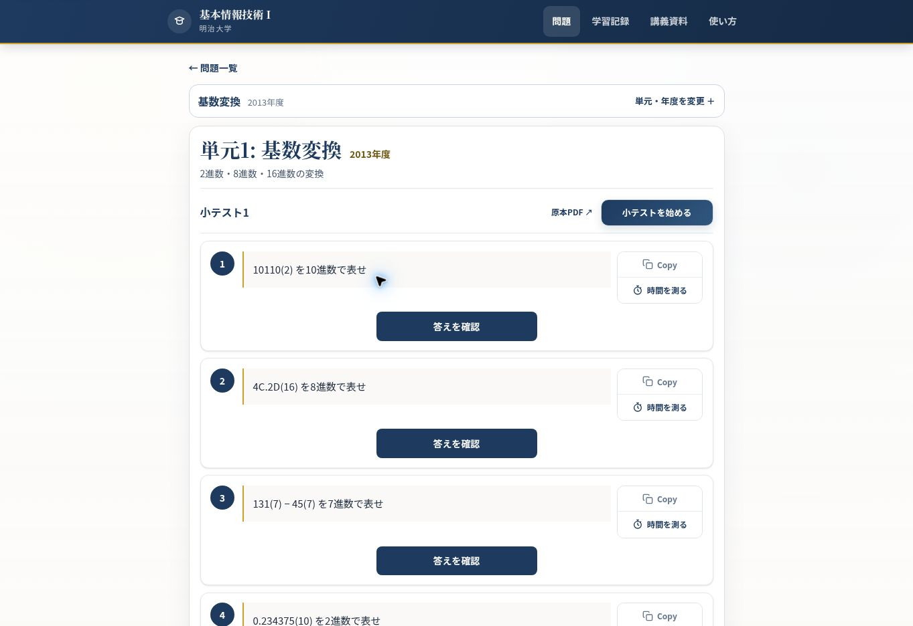
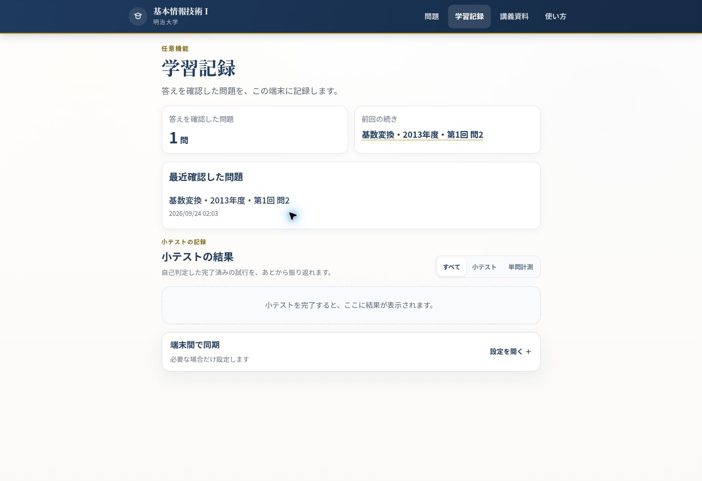

# Concept 3 UI redesign QA

## Scope

- Selected reference: [Quiz UI proposal](docs/images/quiz-mode-ui-proposal.png)
- Desktop capture: 1363 × 936
- Screens: regular question page, learning records, quiz
- Direction: preserve type sizes; reduce content width, spacing, and button dimensions; center the layout.

## Updated screens

### Regular question page

The question list is capped at 52rem. Card gaps and inner spacing are smaller, and each question number sits beside its prompt to reduce card height. The answer disclosure is a 15rem centered button instead of a full-width bar. A compact right-side control stack places “Copy” above the timer action with no gap. On phones, the stack moves below the prompt to preserve reading width.

### Learning records

The content is capped at 48rem. Summary cards and history panels have tighter padding and section gaps.

## Verification

- Regular question page: centered desktop layout, card width, compact answer button, and grouped card actions visually checked. **Pass**.
- Learning records: centered desktop layout, panel spacing, and padding visually checked. **Pass**.
- Quiz: the player width is capped at 44rem. The active player state could not be recaptured because this browser profile contains an unfinished attempt. A JavaScript URL to clear local preview state was rejected by browser security policy; no workaround was attempted.
- Mobile: a responsive Playwright test is included, but this environment has no Chromium executable and its browser download failed, so the test could not run here.

**Overall: partially verified.** Desktop question and records screens pass. Verify the active quiz screen and mobile layout in a Playwright environment with Chromium installed.
