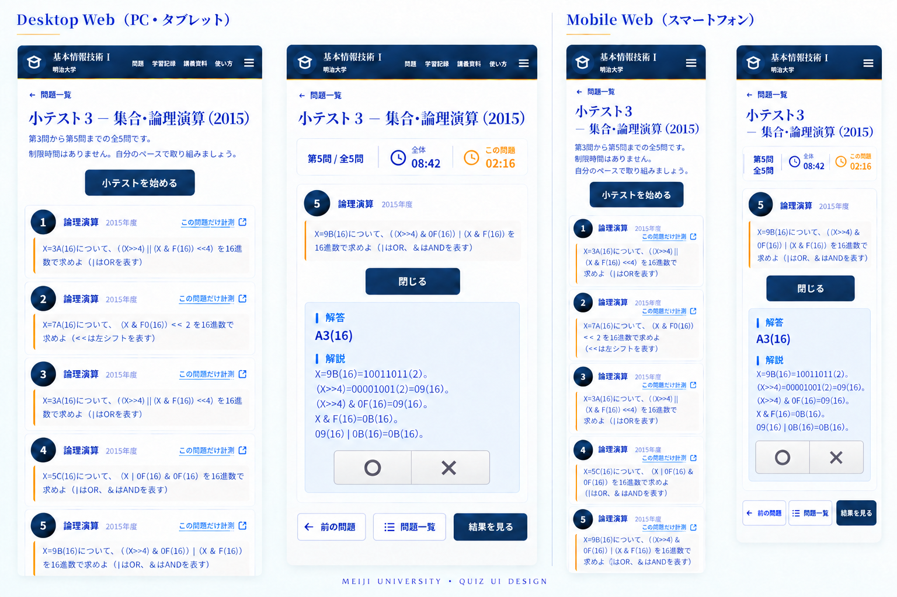

# 小テストモード・試行記録 設計書

- Status: 実装基準
- Date: 2026-09-22
- Scope: 小テストモード、単問計測、自己判定、問題別タイマー、結果集計、端末間同期
- Runtime: HonoX SSR + Hono JSX DOM Island + Cloudflare Workers/D1

## 1. 目的

通常の問題一覧を残したまま、同じ問題データを使って次の2つの学習体験を追加する。

1. 小テストモード
   - 小テスト単位で問題を一問ずつ表示する。
   - 全体の経過時間と、現在の問題を開いている時間を同時に計測する。
   - 前後に移動しても問題ごとの時間は細切れにせず、累積時間として表示する。
   - 解答・解説を確認した後、利用者が自分で ○ / × を選ぶ。
   - 最後に今回の結果と、過去の結果の総合を確認する。

2. 単問計測モード
   - 通常の問題カードから、その問題だけを同じプレイヤーで開始する。
   - 小テストモードと同じタイマー、解答表示、自己判定、保存処理を使う。
   - 問題数が1問のため、画面では重複するタイマーを表示せず「この問題」のタイマーを主表示にする。

自動採点は行わない。正解・不正解は利用者の自己判定であり、解答データからシステムが判定してはならない。

## 2. 既存実装との関係

現在のリポジトリは次の状態である。

| 領域 | 現在の実装 | 小テスト対応後 |
| --- | --- | --- |
| 問題表示 | /[unit]/[year] の SSR で問題カードを一覧表示 | 一覧表示は維持し、入口だけ追加 |
| 解答表示 | details と SolutionReveal で開閉 | 同じ意味をプレイヤー内で再利用 |
| 問題確認履歴 | `fit-question-progress-v1` と `question_progress.revealed_at` の旧形式 | `createdAt` / `updatedAt` へ移行 |
| D1 | `sync_spaces` / `question_progress` の旧スキーマ | `sync_links`、`question_progress`、`challenges`、`answers` の新スキーマ |
| 同期 | 秘密リンクを localStorage に保存し、D1 と統合 | 完了済み小テスト結果も同じ秘密リンクで同期 |
| UI | Hono JSX の SSR と小さな Island | ExamPlayer を追加。画面全体をSPA化しない |
| タイマー | 現行ページには存在しない | プレイヤー内だけで計測 |

既存の question_progress は「答えを確認したか」の履歴であり、自己判定や小テストの試行結果を同じレコードへ混ぜない。

## 3. 決定事項

- 問題データは既存の app/data/exams-json を唯一の正本とする。
- 小テスト開始時に、サーバーから検証済みの問題列を SSR で渡す。プレイヤー開始後に問題データを fetch しない。
- ローディング画面、スピナー、停止ボタン、進捗バーは作らない。
- 小テストの開始・問題移動・自己判定はクライアントで即時に処理する。
- タイマーの正本は現在のブラウザ内の試行状態とする。サーバーで秒数を刻まない。
- document.visibilityState === "visible" の時間だけを計測する。別タブ、バックグラウンド、ページ非表示中の時間は加算しない。
- 問題移動時に現在問題の経過時間を確定し、戻ったときは保存済み累積時間へ加算する。
- 自己判定は1試行の1問題につき1回だけ記録する。同じボタンのダブルクリックは二重記録にならない。
- 同じ小テストを再度行う場合は新しい challengeId を発行し、過去の試行を上書きしない。
- 結果画面では、今回の結果と、同じ小テストを複数回行った総合結果を別々に表示する。
- 「第3回目の挑戦で失敗した」という試行表形式は作らない。必要な情報は試行履歴と問題別集計で確認できるようにする。
- D1 同期は任意機能とし、同期キーを持たない利用者は完全に端末内だけで利用できる。

## 4. 用語

| 用語 | 定義 |
| --- | --- |
| 小テスト | 1つの examNumber と年度に属する問題集合 |
| 小テストモード | questionIds が小テスト全問で構成されるプレイヤー |
| 単問計測モード | questionIds が1問だけで構成されるプレイヤー |
| 試行 | 1回の挑戦を表す不変の challengeId 単位 |
| アクティブ試行 | 完了または破棄されておらず、再開できる試行 |
| 今回の結果 | 1試行に含まれる判定・時間の集計 |
| 総合結果 | 同じ試験または単問の完了済み試行を横断した集計 |
| 自己判定 | 解答を見た後に利用者が押す ○ または × |
| 問題時間 | その問題が現在表示されていた可視時間の累積 |
| 全体時間 | 試行内の全問題時間の合計 |

### 4.1 IDと時刻の命名規則

- D1の各テーブル自身の主キーは汎用的な `id` とする。
- API・クライアントでは用途を明確にするため `challengeId` / `syncLinkId` と呼ぶが、D1へ保存するときにそれぞれ `challenges.id` / `sync_links.id` へ対応付ける。
- 外部キーは関係を表すため `challenge_id` / `sync_link_id` とする。
- D1の時刻カラムは `created_at` / `updated_at` に統一する。用途固有の `revealed_at`、`judged_at`、`completed_at` は作らない。
- `answers.updated_at` は案Bを採用し、試行完了時の `challenges.updated_at` と同じ値にする。

## 5. 全体アーキテクチャ

~~~mermaid
flowchart TD
  A[通常の問題一覧] -->|小テストを始める / この問題だけ計測| B[ExamPlayer Island]
  B --> C[Reducerによる試行状態]
  C --> D[可視時間だけを加算するTimer Runtime]
  C --> E[localStorageのアクティブスナップショット]
  C --> F[完了結果・今回の結果]
  F --> G[結果画面・学習記録]
  F -->|任意の秘密リンク同期| H[Hono API]
  H --> I[Cloudflare D1]
~~~

### 5.1 サーバーとクライアントの責務

| 責務 | サーバー | クライアント |
| --- | --- | --- |
| 問題データ | JSONから検証し、問題列を SSR で提供 | 受け取った問題を表示 |
| 小テスト構成 | 単元・年度・試験番号・問題順を検証 | 変更不可の入力として保持 |
| タイマー | 計測しない | 可視時間を計測し、累積する |
| 自己判定 | 判定しない | ○ / × の入力を受け取る |
| アクティブ状態 | 保持しない | localStorage に保存し再開する |
| 完了結果 | 同期時だけ受け取って保存 | 完了時にスナップショットを作る |
| 集計 | 同期済みデータを検索可能にする | 端末内データを即時集計する |

## 6. 機能別設計

### 6.1 試験開始と単問計測の入口

#### Backend

- 通常の /{unit}/{year} は従来どおり SSR する。
- 各小テストの見出しに「小テストを始める」の入口を置く。
- 各問題カードには「この問題だけ計測」の入口を置く。
- 入口のリンクは、静的JSONの `examId` と、単問の場合だけ `questionId` を持つ。
- `unitId`、`year`、`examNumber` は現在のページを構成するためのURL情報であり、試行の識別情報として保存しない。
- 推奨 URL は次のとおりとする。
  - 小テスト: /{unit}/{year}/exam?exam={examNumber}
  - 単問: /{unit}/{year}/exam?exam={examNumber}&question={questionId}
  - 結果: 同じURLに `view=result&challenge={challengeId}` を付与
- Exam route は query を検証し、存在しない単元・年度・試験・問題なら 404 を返す。
- 小テストの問題順はサーバーが exam.questions の順序から決める。クライアントから送られた問題順を正本にしない。
- Exam route は問題データを SSR で Island に渡す。開始後の問題取得用 API は作らない。

#### Design

- 通常ページの一覧性は維持し、入口だけを追加する。
- 小テスト開始ボタンは小テスト見出しの説明直下に配置する。
- 単問計測は各問題カードの補助操作として配置し、通常の解答確認と混同させない。
- ボタンは全幅にせず、内容幅に合う横長のボタンを中央に置く。
- クリック後はローディング表示を出さず、View Transition 対応環境では入口からプレイヤーへ切り替える。

#### Frontend

- SSR 側は通常の a 要素として入口を出す。JavaScript が無効でも Exam route へ遷移できるようにする。
- Exam route の ExamPlayer Island が初期化時に、次を行う。
  1. 同期的に二重実行ガードを立てる。
  2. 同じ scope のアクティブ試行を検索する。
  3. 再開するか新規開始するかを決める。
  4. 新規開始の場合だけ challengeId を一度だけ生成する。
  5. INIT を dispatch し、プレイヤーを表示する。
- 新規開始時に既存アクティブ試行がある場合は、次の2択を表示する。
  - 「続きから」
  - 「最初から」
- 既存試行に判定済みの問題がある場合、「最初から」は既存試行を incomplete として端末内履歴へ残し、新しい challengeId を発行する。

#### State management

入口では状態を持ちすぎない。開始後の状態は ExamPlayer が一元管理する。

    scopeKey = examId + (questionId ? "/question/" + questionId : "/exam")
    challengeId = crypto.randomUUID()

scopeKey は再開対象を検索するためだけに使い、試行の識別には必ず challengeId を使う。

challengeId の発行と再利用は次のとおりとする。

1. Exam route を開いただけでは発行しない。
2. 「小テストを始める」または「この問題だけ計測」を実際に確定した瞬間に `crypto.randomUUID()` で発行する。
3. 発行直後に `createdAt`、対象試験、対象問題、最初の問題を含むアクティブスナップショットを localStorage へ保存し、その後にタイマーを開始する。
4. 再読込、ページ離脱、タブ復帰では同じ challengeId を再利用する。
5. 完了後の「もう一度挑戦」または「最初から」だけ、新しい challengeId を発行する。

これにより、クリックの二重実行やページを開き直しただけの試行増加を防ぐ。

IDの役割と発行タイミングは次のとおりである。

| ID | 発行元 | 発行タイミング | 再読込・再同期時 | 保存先 |
| --- | --- | --- | --- | --- |
| `syncLinkId` | サーバー。秘密キーのSHA-256ハッシュから導出 | 「同期リンクを作る」を押した時に1回 | 同じ秘密リンクから同じIDを導出 | D1では `sync_links.id` として参照される |
| `challengeId` | クライアント。`crypto.randomUUID()` | 実際に試行を開始した時に1回 | アクティブ試行を再開する限り同じID | D1では `challenges.id` として保存される |
| `examId` | 静的JSON | 発行しない | JSONの `Exam.id` をそのまま再利用 | `challenges.exam_id` |
| `questionId` | 静的JSON | 発行しない | JSONの `Question.id` をそのまま再利用 | `answers.question_id` |

同期キーを持たない状態で開始しても `challengeId` は先に発行できる。後から同期を有効化した場合、同期時のヘッダーから `syncLinkId` を解決し、元の `challengeId` と `createdAt` を変えずに完了結果を追加する。

#### Timer

- 試行開始の入力を受け付けた時点を最初の問題の計測開始とする。
- 単問計測も同じタイマーランタイムを使う。
- 開始ボタンの二重クリックは最初の challengeId だけを採用する。

### 6.2 試験プレイヤーと問題移動

#### Backend

- Exam route はプレイヤーに必要な全問題を一度に渡す。
- 問題の解答・解説は既存データを使用し、プレイヤー専用の別データを作らない。
- SSR で渡す問題列は改変不可の入力として扱う。

#### Design

プレイヤーは一問一答の固定レイアウトとする。

上部:

- 「第3問 / 全5問」
- 「全体 08:42」
- 「この問題 02:16」

中央:

- 問題番号、問題文、図表、選択肢
- 「答えを確認」または「閉じる」
- 開いた場合の解答・解説
- 解答・解説の一番下に丸バツ判定コントロール

下部の共通フッター:

- 左: 「前の問題」
- 中央: 「問題一覧」
- 右: 通常は「次の問題」、最終問題は「結果を見る」

次の要素は表示しない。

- 進捗バー
- 停止・一時停止ボタン
- 「今回の判定」のような補足見出し
- ローディングモーダル

問題遷移は、ヘッダー・タイマー・フッターを固定したまま、問題領域だけを View Transition で切り替える。

#### UI案

PC・タブレットとスマートフォンの両方で、問題一覧から小テストを開始し、問題を一問ずつ切り替える構成を示す。解答・解説を開いた後にだけパネル内へ ○ / × を表示し、画面下部には共通フッターを置く。

この画像では、次の仕様を確認できる。

- 全体タイマーと現在問題タイマーを同時に表示する。
- 解答確認ボタンは、開いた後に「閉じる」へ変わる。
- ○ / × は解答・解説パネルの中に置き、文字ラベルを付けない。
- 最終問題の共通フッターは「前の問題 / 問題一覧 / 結果を見る」とする。

#### Frontend

- ExamPlayer が現在の問題だけを DOM に描画する。
- 前後移動時に全問を再描画しない。
- 「前の問題」は第1問でも領域を確保したまま disabled にする。
- 最終問題の右ボタンは「結果を見る」に置き換える。
- 「結果を見る」は全問の判定が完了するまで disabled にする。
- 「問題一覧」ボタンは現在の試行を保存して、プレイヤー内の問題一覧を開く。一覧から任意の問題へ戻れる。
- ブラウザの戻る・進むとプレイヤー内の問題位置を同期する場合は query の question を使う。ただし履歴を過剰に増やさないため、通常の問題移動は replaceState を優先する。

#### State management

問題表示は次の状態から導出する。

    currentIndex
    currentQuestionId
    revealedQuestionIds
    judgments[questionId]
    questionElapsedMs[questionId]

全体時間は `questionElapsedMs` の合計から導出し、別の経過時間フィールドは持たない。

問題移動の処理順は固定する。

1. 現在時刻でタイマーを flush する。
2. 現在問題の累積時間を保存する。
3. 次の currentIndex を決める。
4. View Transition を開始する。
5. 遷移完了後、新しい問題の計測基準時刻を設定する。
6. スナップショットを保存する。

前後移動で questionElapsedMs[questionId] を初期化してはならない。

#### Timer

- 問題移動前に現在問題へ最後の時間を加算する。
- 次の問題の時間は、遷移完了後から計測する。
- 前の問題へ戻った場合は、保存済み時間へ新しい可視時間を加算する。
- 問題移動によるアニメーション時間を問題時間へ含めない。

### 6.3 解答表示と丸バツ自己判定

#### Backend

- 解答・解説の表示自体は既存の問題データを使う。
- 自動採点はしない。
- 自己判定は judgment: "correct" | "incorrect" として保存する。
- 既存の答え確認履歴も維持する。解答を開いた時点で question_progress 相当の記録を更新する。初回は `createdAt` と `updatedAt` を同じ値で作成し、再確認時は `updatedAt` だけを更新する。
- 自己判定は小テスト試行の結果にだけ紐付ける。通常ページでの答え確認と混同しない。
- 通常ページの答え確認履歴は、初回確認時に `createdAt` と `updatedAt` を同じ値で作成し、再確認時は `updatedAt` だけを更新する。

#### Design

閉じた状態:

- 「答えを確認」
- 丸バツコントロールは非表示

開いた状態:

- ボタンの表記を「閉じる」に変更
- 解答・解説パネルを表示
- パネルの一番下に、アイコンだけの「○」と「×」を表示

丸バツコントロールの状態:

| 状態 | ○ | × |
| --- | --- | --- |
| 未選択 | 同じニュートラルなグレー | 同じニュートラルなグレー |
| ○を選択 | 控えめな緑系 | グレー |
| ×を選択 | グレー | 控えめな赤系 |
| 判定済み | 選択状態を保持 | 選択状態を保持 |

アイコンだけで意味を表現するため、実装上は必ず次のアクセシブルな名前を付ける。

- ○: 「正解として記録」
- ×: 「不正解として記録」

画面上に「正解」・「不正解」の文字は表示しない。

#### Frontend

- SolutionReveal の開閉と、JudgmentControl の表示条件を分離する。
- JudgmentControl は revealed === true のときだけレンダリングする。
- 丸バツのクリックは JUDGE_QUESTION を dispatch する。
- 既に判定済みなら同じボタンを押しても何もしない。
- 一度選択した判定を同じ試行内で上書きしない。やり直しは新しい試行で行う。
- 判定を保存した後も解答・解説は表示したままにする。

#### State management

    judgments[questionId] = null | "correct" | "incorrect"
    revealedQuestionIds: Set<QuestionId>

JUDGE_QUESTION の不変条件:

1. 対象問題が現在の試行に存在する。
2. 解答が表示済みである。
3. 対象問題が未判定である。
4. 一度だけ回答結果を作成し、`answers.created_at` に最初のクリック時刻を保存する。

この不変条件によって、ダブルクリック、二重イベント、再描画による重複記録を防ぐ。

#### Timer

- 解答を開いている間も、現在問題が表示されている限り問題時間を計測する。
- ○または×を選択した入力時点では、保存のために現在値を flush する。ただし計測自体は継続する。
- 判定後も、同じ問題を表示している間は「問題を開いていた時間」として計測する。
- 問題時間の確定は、次の問題へ移動する時、ページを非表示にする時、または結果画面へ進む時に行う。
- このタイマーは自動的な「純粋な解答時間」ではなく、問題ページの可視時間である。純粋な解答時間を別に計測する操作は今回のスコープに含めない。
- 判定済み問題へ戻った場合も、表示している間は保存済み時間へ加算する。

### 6.4 結果画面と総合結果

#### Backend

- 完了済み試行のスナップショットを D1 に保存できる。
- 同期キーがない場合は localStorage の完了履歴だけを使う。
- サーバーは正解を再計算しない。保存された judgment を集計するだけである。
- 同じ challengeId が複数回送信されても、1試行として扱う。

#### Design

結果画面は次の2層に分ける。

1. 今回の結果
   - 正解数 / 判定数
   - 正解率
   - 合計時間
   - 問題ごとの ○ / ×
   - 問題ごとの累積時間

2. これまでの結果
   - 試行回数
   - 判定総数
   - 正解数・不正解数
   - 正解率
   - 合計学習時間
   - 問題別の正解回数・不正解回数・平均時間
   - 過去の完了日時と合計時間の一覧

試行ごとの詳細表を常時表示せず、まず今回と総合の差を明確にする。過去の試行を選択した場合だけ、その試行の問題別結果を展開する。

未完了試行は「完了済みの試行回数」には含めない。ただし、途中まで判定した値を失わないため、端末内では incomplete として保持する。

#### Frontend

- ExamResult は challengeId を受け取り、localStorage から完了スナップショットを読む。
- 表示上の試行番号は保存値ではなく、同じ scope の完了日時順から計算する。
- 結果の再読み込み時も、同じ challengeId から同じ結果を再構成する。
- /records は既存の答え確認履歴を残し、その下に小テスト結果のセクションを追加する。
- scope のフィルターを次の単位で提供する。
  - すべて
  - 単元
  - 小テスト
  - 単問計測

#### State management

集計値は保存せず、完了スナップショットから導出する。

    correctCount = results.filter(judgment === "correct").length
    incorrectCount = results.filter(judgment === "incorrect").length
    judgedCount = correctCount + incorrectCount
    accuracy = judgedCount === 0 ? null : correctCount / judgedCount
    totalElapsedMs = sum(results.questionElapsedMs)

総合正解率は試行ごとの正解率を平均しない。全試行の判定数を分母にする。

    aggregateAccuracy = allCorrectCount / allJudgedCount

これにより、問題数や未完了状態が異なる試行でも正しく重み付けされる。

#### Timer

- 結果画面へ遷移する入力時点で現在問題を flush する。
- 全問判定済みでなければ完了扱いにしない。
- status を completed にした後は、その試行のタイマーを停止し、結果画面で増加させない。
- 結果画面から戻っても、同じ試行を再開可能なアクティブ状態には戻さない。

### 6.5 ページ離脱、再読込、再開

#### Backend

- アクティブ試行はサーバーへ逐次送信しない。
- 途中状態をサーバーへ送信すると、複数端末で同じ試行を同時編集した際の競合が複雑になるためである。
- 完了済み試行だけを任意同期の対象とする。

#### Design

| 操作 | 画面上の扱い |
| --- | --- |
| 同じページ内で前後移動 | そのまま累積して続行 |
| 通常ページへ戻る | 自動保存。試行はアクティブのまま |
| ブラウザの再読込 | 同じ試行を復元 |
| タブを閉じる | 最後に flush した状態を復元 |
| 再度同じ小テストを開く | 「続きから」または「最初から」 |
| 完了後に再挑戦 | 新しい試行を作成 |
| 別タブで同じ試行を開く | 片方を編集元とし、もう片方は警告を表示 |

停止ボタンは提供しない。ページを離れることが停止ではなく、可視時間の計測が一時停止するだけである。

#### Frontend

- visibilitychange、pagehide、pageshow を登録する。
- pagehide では同期処理を待たず、同期的に可能な範囲でスナップショットを保存する。
- localStorage の storage イベントと BroadcastChannel を使い、別タブの更新を検知する。
- 同じ challengeId が別タブで編集された場合、後から開いたタブを読み取り専用にする。
- navigator.locks が利用できる場合は試行単位の編集ロックに利用する。利用できない場合は、短い lease と BroadcastChannel をフォールバックにする。

#### State management

アクティブ状態は次のように分ける。

    active
      - 画面が可視で計測中
      - 画面が非表示で計測停止中
      - ページを離れたが再開可能

    incomplete
      - 利用者が最初からやり直すことを選んだ
      - 少なくとも1問の判定を持つ
      - 総合結果の完了試行数には含めない

    completed
      - 全問判定済み
      - 結果画面へ遷移済み
      - 時間・判定を凍結

不正なスナップショット、バージョン不一致、必須項目欠落は破棄し、問題表示自体は継続する。既存の学習記録と同じく、記録の破損で問題閲覧を止めない。

#### Timer

- 非表示になった瞬間に最後の可視時間を flush する。
- 非表示中は時間を加算しない。
- 可視に戻った瞬間を新しい計測基準時刻にする。
- 再読込後は保存済み累積時間から開始し、再読込前からの経過時間を推測して加算しない。

### 6.6 端末内保存とD1同期

#### Backend

既存の秘密リンク方式を再利用する。

- 秘密キーの生値は D1 に保存しない。
- D1 には SHA-256 の同期リンクIDを `sync_links.id` として保存する。
- `sync_links` は秘密リンク1本に対応する記録の入れ物であり、試行ごとには作らない。
- 既存の question_progress は答え確認履歴として残す。
- 完了済み試行は `challenges`、問題ごとの自己判定と時間は `answers` に保存する。
- D1 へ送信するのは完了済み試行だけとする。途中状態は localStorage のみで保持する。
- /progress の削除では、答え確認履歴と試行結果を同じ `sync_link_id` 単位で削除する。
- 既存の `/progress/sync` は次の形式で答え確認履歴を送受信する。

      {
        "entries": [
          {
            "questionId": "exam3-2015-q1",
            "unitId": "unit-logic",
            "createdAt": 1790000000000,
            "updatedAt": 1790000500000
          }
        ]
      }

新しい API:

| Method | Path | 役割 |
| --- | --- | --- |
| POST | /progress/links | 秘密リンクと同期先を発行 |
| POST | /progress/sync | 既存。答え確認履歴を統合 |
| POST | /progress/challenges | 完了済み試行を統合 |
| DELETE | /progress/ | 答え確認履歴と試行結果を削除 |

既存の `/progress/spaces` は移行期間だけ `/progress/links` の別名として残せる。内部のテーブル名・型名は `sync_links` / `SyncLinkId` に統一する。APIの `syncLinkId` はD1の `sync_links.id` に、APIの `challengeId` はD1の `challenges.id` に対応付ける。D1の主キー名をAPIの用途名に合わせて変更しない。

POST /progress/challenges は空の challenges を受け取った場合でも、同期リンクにある完了済み試行を返せるようにする。これにより新しい端末が先にデータを取得できる。

リクエスト例:

    {
      "challenges": [
        {
          "challengeId": "550e8400-e29b-41d4-a716-446655440000",
          "examId": "exam3-2015",
          "createdAt": 1790000000000,
          "updatedAt": 1790000500000,
          "answers": [
            {
              "questionId": "exam3-2015-q1",
              "elapsedMs": 230000,
              "judgment": "correct",
              "createdAt": 1790000230000,
              "updatedAt": 1790000500000
            }
          ]
        }
      ]
    }

#### Design

- 同期設定は現在の /records の「端末間で同期」に統合する。
- 既存の秘密リンクUIを増やしすぎず、同期対象に「答え確認履歴」と「小テスト結果」が含まれることを説明する。
- 同期失敗時もローカルの結果は保持する。
- 秘密リンクのURL、キー、`sync_links.id` は画面上の結果一覧に表示しない。`challengeId` は秘密情報ではないため、結果URLのクエリや同期payloadで使用してよい。

#### Frontend

  - 完了時にローカルへ保存した後、同期キーがある場合だけ非同期で /progress/challenges を呼ぶ。
- 同期中でも結果画面をブロックしない。
- 同じ試行を何度送っても、クライアント側とサーバー側で重複しない。
- 同期応答の結果はローカルへマージする。
- API失敗時は「同期できませんでした」を表示し、再試行できるようにする。

#### State management

同期状態は学習状態と分離する。

    syncStatus = "idle" | "syncing" | "succeeded" | "failed"

同期失敗を試行の incomplete や abandoned と解釈してはならない。保存済み結果の正しさと、サーバーへの複製状態は別である。

#### Timer

- 同期の待ち時間を小テスト時間へ含めない。
- 完了時点でタイマーは停止しているため、同期の遅延で totalElapsedMs を増やさない。

## 7. 状態モデル

### 7.1 永続化する試行型

実装時は Zod Mini のスキーマを作り、localStorage と API の境界で検証する。

    type Judgment = "correct" | "incorrect";
    type ChallengeStatus = "active" | "incomplete" | "completed";

    type ProgressEntry = {
      questionId: QuestionId;
      unitId: UnitTabId;
      createdAt: number;
      updatedAt: number;
    };

    type ChallengeQuestionSnapshot = {
      questionId: QuestionId;
      elapsedMs: number;
      judgment: Judgment | null;
      answerCreatedAt: number | null;
    };

    type ChallengeSnapshot = {
      schemaVersion: 1;
      challengeId: string;
      scopeKey: string;
      examId: ExamId;
      targetQuestionId: QuestionId | null;
      createdAt: number;
      updatedAt: number;
      status: ChallengeStatus;
      currentIndex: number;
      revealedQuestionIds: QuestionId[];
      questions: ChallengeQuestionSnapshot[];
    };

    type CompletedAnswer = {
      questionId: QuestionId;
      elapsedMs: number;
      judgment: Judgment;
      createdAt: number;
      updatedAt: number;
    };

    type CompletedChallengePayload = {
      challengeId: string;
      examId: ExamId;
      createdAt: number;
      updatedAt: number;
      answers: CompletedAnswer[];
    };

`ProgressEntry` は既存の答え確認履歴の型であり、`ChallengeQuestionSnapshot` とは分ける。前者が `question_progress` へ同期する `createdAt` / `updatedAt` を持ち、後者は現在の試行内で答えを開いたかどうかを `revealedQuestionIds` で管理する。`CompletedAnswer.updatedAt` は案Bにより、試行完了時の `CompletedChallengePayload.updatedAt` と同じ値にする。

`currentIndex` と `revealedQuestionIds` はアクティブ試行に必要であり、完了結果では表示復元のために残してもよい。`totalElapsedMs` は保存せず、`questions[].elapsedMs` の合計から導出する。端末内では `targetQuestionId` が null なら試験全体、値があれば単問と解釈する。`updatedAt` はチェックポイント更新のたびに更新し、最後の更新値が完了時刻になる。

`targetQuestionId`、`scopeKey`、表示中の問題、解答表示状態は端末内の再開にだけ使う。D1同期の `CompletedChallengePayload` には送らず、試験全体か単問かは回答件数と静的JSONからサーバーが導出する。

### 7.2 Reducer の主要 Action

| Action | 内容 |
| --- | --- |
| INIT | 新しい試行または保存済み試行をプレイヤーへ投入 |
| REVEAL_QUESTION | 解答表示済みとして記録 |
| JUDGE_QUESTION | ○ / × を一度だけ記録 |
| APPLY_ELAPSED | 可視時間を現在問題へ加算。全体表示は問題時間の合計から導出 |
| MOVE_TO | 前後の問題へ移動 |
| COMPLETE | 結果画面へ進み、時間を凍結 |
| MARK_INCOMPLETE | 中断した試行を履歴へ残す |

visibilitychange、pagehide、通信結果、タイマーのflushは副作用シェルが扱い、必要な差分・結果だけを上記Actionとしてreducerへ渡す。

Reducer は performance.now() や DOM に直接依存しない。TICK と FLUSH_TIMER には、Timer Runtime が計算した安全な差分だけを渡す。

### 7.3 状態遷移

~~~mermaid
stateDiagram-v2
  [*] --> ActiveVisible: START_ATTEMPT / RESUME_ATTEMPT
  ActiveVisible --> ActiveHidden: visibilitychange hidden
  ActiveHidden --> ActiveVisible: visibilitychange visible
  ActiveVisible --> ActiveVisible: TICK / NAVIGATE / REVEAL / JUDGE
  ActiveHidden --> ActiveHidden: pagehide / storage
  ActiveVisible --> Completed: COMPLETE_ATTEMPT
  ActiveHidden --> Completed: result navigation after resume
  ActiveVisible --> Incomplete: RESTART_ATTEMPT
  ActiveHidden --> Incomplete: discard and restart
  Completed --> [*]
  Incomplete --> [*]
~~~

### 7.4 状態・保存・完了の確定タイミング

この機能では「確定」を3つに分けて扱う。UI上の状態確定、復元用チェックポイントの保存、試行完了は同じ瞬間ではない。

1. **状態の確定**
   Action を受け取った reducer が、既存のオブジェクトを変更せず新しい ChallengeState を返した時点で確定する。○ / × は、解答が開かれた状態で最初のクリックを受け付けた瞬間に確定する。判定後の上書きは行わない。
2. **チェックポイントの確定**
   reducer の新しい状態をシリアライズし、localStorage へ正常に書き込めた時点で、そのページを開き直した場合の復元地点が確定する。保存失敗時もメモリ上の状態は正本として継続するが、離脱後の復元は保証しない。
3. **試行の完了**
   すべての問題が判定済みで、最後の問題から結果画面へ進むために「結果を見る」を押した時点で、現在問題の時間を最後に flush する。その更新で status を completed にし、`updatedAt` を保存してタイマーを凍結する。`updatedAt` の最終値がその試行の完了時刻になる。

| 操作 | 状態の確定 | タイマーの扱い | 保存・重複 |
| --- | --- | --- | --- |
| 答えを確認する / 閉じる | 解答表示フラグだけを更新。正解・不正解は確定しない | 現在問題が表示中なら継続 | 開閉のたびに判定を増やさない |
| ○ / × の最初のクリック | judgment と `answerCreatedAt` をその場で確定 | クリック時点までを flush するが、同じ問題の表示中は継続 | 最初の判定を採用し、二回目以降は no-op |
| 前後の問題へ移動 | currentIndex を更新し、移動前の問題時間を確定 | 移動前を flush。移動後は新しい基準時刻から再開 | 移動前後のスナップショットを保存 |
| タブ切替・ページ非表示・pagehide | 現在の状態を維持し、可視区間を確定 | flush して停止。非表示中の時間は加算しない | 保存済みチェックポイントを更新 |
| 最終問題で結果を見る | completed と最終 `updatedAt` を確定 | 最後の flush 後に停止・凍結 | 完了履歴へ一度だけ追加し、challengeId で冪等化 |
| ○ / × のダブルクリック、遅延イベント、再描画後の再送 | 既存 judgment と `answerCreatedAt` を変更しない | 追加の判定区間を作らない | reducer と API の両方で no-op / 冪等化 |
| ページを開き直す | active 試行の最新チェックポイントから復元 | 保存済み累積値から再開。閉じていた時間は推測して加算しない | 同じ challengeId を継続し、新しい試行を作らない |

したがって、回答結果の確定は ○ / × の最初のクリック時、問題時間の確定は問題を離れる時、試行全体の確定は「結果を見る」を押した時である。答えを開いた時刻は表示履歴として保存できるが、正解・不正解の確定とは別のイベントである。

ローカルのアクティブスナップショットはチェックポイントとして保存するが、D1へ送る `challenges.updated_at` は試行完了時にだけ確定する。完了時の最後の更新で `status` が `completed` になり、その時点の `updated_at` を完了時刻として表示する。完了後は試行を変更しないため、別の完了時刻カラムは保存しない。同期の再試行は同じ `updated_at` とpayloadを使うので、時刻を進めない。

案Bでは、`answers.updated_at` を問題時間のflushごとには更新しない。結果を見る操作で試行を完了させるとき、`challenges.updated_at` を確定し、すべての `answers.updated_at` に同じ値を設定する。これにより、アクティブ試行の細かなチェックポイントをD1へ保存せず、D1上の回答行は完了時の不変スナップショットになる。

## 8. タイマー計算ロジック

### 8.1 基本方針

- 経過時間の計測には performance.now() を使う。
- Date.now() は試行の `createdAt`、回答結果の `createdAt`、試行完了時の `updatedAt` の保存にだけ使う。案Bでは、完了時の `challenges.updatedAt` を `answers.updatedAt` にも設定する。
- performance.now() の差分を毎回保存せず、イベントと一定間隔の flush で累積値へ反映する。
- ブラウザの時計変更によって問題時間が増減しないようにする。
- lastSample より小さい時刻、負の差分、極端に大きい差分は 0 として扱う。

### 8.2 Timer Runtime

実行時だけ次の値を持つ。これらはそのまま永続化しない。

    type TimerRuntime = {
      running: boolean;
      lastSample: number | null;
      currentQuestionId: QuestionId;
    };

lastSample は現在の可視区間の開始点または最後の tick 時刻である。

### 8.3 差分計算

現在時刻 now で flush する処理は次のとおり。

    delta = running && lastSample !== null
      ? max(0, now - lastSample)
      : 0

    challenge.questions[currentQuestionId].elapsedMs += delta
    runtime.lastSample = now

この処理を reducer へ渡す前に行わず、必ず Timer Runtime から TICK または FLUSH_TIMER として渡す。

### 8.4 イベントごとの計算

| イベント | 処理 |
| --- | --- |
| 試行開始 | running=true、lastSample=performance.now() |
| 1秒表示更新 | 現在値との差分を加算し、次の更新を予約 |
| 問題移動 | 現在問題を flush、running=false、遷移完了後に次問で再開 |
| 解答を開く | 計測を継続 |
| ○ / × 選択 | 選択時点まで flush。判定は確定するが、表示中の問題時間は継続 |
| visibilitychange:hidden | flush、running=false |
| visibilitychange:visible | lastSample=performance.now()、running=true |
| pagehide | flush と保存。非同期通信は待たない |
| pageshow | 保存済み値から再開 |
| 結果を見る | flush、running=false、最終 `updatedAt` を保存 |

### 8.5 問題ごとの累積

問題 q1 から q2 へ進み、再び q1 へ戻った場合:

    q1 = firstSegment + secondSegment + ...
    total = q1 + q2 + ...

問題ごとに openedAt と closedAt の1区間だけを保存する設計にはしない。必要なのは表示・集計用の累積値であり、細切れ区間の履歴ではない。

### 8.6 表示値

- 内部値は整数ミリ秒で保持する。
- 表示は切り捨てた秒単位にする。
- 60分未満は MM:SS、60分以上は H:MM:SS とする。
- 表示専用の丸めで永続値を変更しない。
- 全体時間は sum(question.elapsedMs) と一致させる。

### 8.7 可視性とバックグラウンド

- visibilitychange を第一の停止・再開イベントとする。
- pagehide は保存の最後の機会として扱う。
- beforeunload だけに依存しない。
- 非表示中にタイマーが throttling されても、非表示になる時点で flush しているため加算されない。
- 復帰時は隠れていた時間を推測して加算しない。

### 8.8 Immutable core と副作用シェル

状態の正しさをタイマーやブラウザAPIの都合から切り離すため、実装は Functional Core / Imperative Shell に分ける。Core は入力から新しい値を返すだけにし、Shell が時刻取得、保存、通信、DOMイベントを担当する。

~~~mermaid
flowchart LR
  A[ブラウザイベント] --> B[副作用シェル]
  B --> C[純粋な reducer / 計算]
  C --> D[新しい immutable state]
  D --> B
  B --> E[保存・同期・表示]
~~~

#### Immutable な純粋関数

次の関数は同じ入力に対して同じ出力を返し、Date、performance、DOM、localStorage、fetch、D1、dispatch に直接触れない。引数の配列やオブジェクトを in-place で変更せず、新しい値を返す。

- calculateElapsedDelta(runtime, now)
- applyElapsedDelta(state, delta)
- challengeReducer(state, action)
- createChallengeSnapshot(state)
- aggregateChallengeResults(challenges)
- mergeCompletedChallenges(local, remote)
- formatDuration(elapsedMs)
- validateChallengeSnapshot(input)

reducer の実装は、たとえば JUDGE_QUESTION を受けた時に対象の questions 要素と judgments map をコピーして新しい state を返す。対象がすでに判定済みなら、同じ state を返すか、意味的に同値な新しい state を返してもよいが、`answerCreatedAt` と判定値を上書きしてはいけない。Timer Runtime の lastSample を直接 reducer から変更してはならない。

    const nextState = challengeReducer(state, {
      type: "JUDGE_QUESTION",
      questionId,
      judgment: "correct",
      answerCreatedAt,
    })

    const nextElapsed = applyElapsedDelta(nextState, delta)

純粋関数のテストでは、同じ state を二回入力して元の state が変わらないこと、同じ JUDGE_QUESTION を二回適用して判定が一回分だけであること、時計を進めた差分が負値や過大値にならないことを確認する。

#### 副作用を持つ mutable な境界

次の処理は外部状態を扱うため、コンポーネントの任意の箇所に散在させず、専用の adapter / controller に閉じ込める。

- TimerController: performance.now() を読み、差分を計算して TICK / FLUSH_TIMER を dispatch する。現在の lastSample、running、heartbeat の予約は useRef 内の mutable runtime に限定する。
- LifecycleController: visibilitychange、pageshow、pagehide を購読し、TimerController と保存処理を呼ぶ。イベント listener は useEffect の cleanup で解除する。
- ChallengeStorage: localStorage の read、write、serialize、quota error の扱いを担当する。
- ChallengeSyncApi: 完了後の D1 API 呼び出しと challengeId による冪等化を担当する。
- ChallengeRepository: 完了履歴の追加、remote との merge、保存順序を担当する。
- ViewTransitionAdapter: startViewTransition の存在確認と表示切り替えを担当する。遷移アニメーションを記録の正本にしない。
- ChallengeIdFactory: challengeId の生成だけを担当する。

処理の境界は、概念的には次の形にする。

    function commit(action, persist) {
      const next = challengeReducer(currentState, action)
      currentState = next
      render(next)
      if (persist) {
        storage.write(createChallengeSnapshot(next))
      }
    }

実装では currentState、storage、render、clock をモジュールの隠れた共有変数にせず、hook または controller の依存値として渡す。特に reducer 内で localStorage.setItem、fetch、performance.now、window.location の変更を行わない。逆に、TimerController が judgment の内容を直接書き換えず、時間差分を Action として渡すことで、時刻処理と状態遷移の責務を分離する。

この分離により、純粋関数はブラウザなしの unit test で検証でき、副作用シェルは fake clock、fake storage、fake visibility event、fake API を注入した integration test で検証できる。保存・同期の失敗を UI の判定ロジックへ漏らさず、状態確定と永続化成功を別の結果として扱える。

## 9. Hono JSX DOM の使用方針

試行の状態は hono/jsx/dom Island に閉じ込める。既存の SSR 画面全体をクライアント管理へ移行しない。

| API | 採用 | 用途 |
| --- | --- | --- |
| useReducer | 採用 | ChallengeState と Action の一元管理 |
| useEffect | 採用 | visibility、pagehide、storage、タイマー更新 |
| useRef | 採用 | Timer Runtime、二重送信ガード、mount状態 |
| useMemo | 必要な箇所のみ | 結果集計や表示用派生値 |
| useViewTransition | 採用 | 問題領域だけの切り替え |
| useTransition | 初期実装では不採用 | スケジューリング用であり、見た目の遷移ではないため |
| Suspense | 初期実装では不採用 | 問題データは SSR 済みで、ローディングUIを出さないため |
| useOptimistic | 初期実装では不採用 | localStorage の即時更新に楽観状態を重ねる必要がないため |

useViewTransition が使えないブラウザでは、通常の即時表示へフォールバックする。アニメーションは計測状態の正本にならない。

## 10. localStorage のキーと保存単位

既存キーと衝突させない。

| Key | 内容 |
| --- | --- |
| fit-question-progress-v1 | 既存。答え確認履歴 |
| fit-sync-key-v1 | 既存。秘密同期キー |
| fit-challenge-active-v1 | アクティブ試行の map |
| fit-challenge-history-v1 | incomplete / completed の試行履歴 |

`fit-question-progress-v1` は `revealedAt` だけを持つ旧形式である。新形式では `fit-question-progress-v2` を使用し、旧データがある場合は `createdAt` と `updatedAt` の両方へ旧 `revealedAt` を設定して移行する。

### 保存タイミング

- 試行開始直後
- 解答表示
- ○ / × の判定
- 問題移動
- visibility hidden
- pagehide
- 一定間隔の heartbeat
- 結果画面へ遷移する直前

毎フレーム保存は行わない。Heartbeat は表示更新と分離し、原則5秒以上の間隔にする。

### 保存失敗

- QuotaExceededError や private browsing の制限で保存できなくても問題表示は継続する。
- 画面上は記録不能であることを status として通知する。
- タイマーはメモリ上で継続するが、ページ離脱後の復元は保証できない。
- 既存の答え確認処理と同じく、保存失敗で解答表示を止めない。

## 11. D1 スキーマ案

現行のD1には `sync_spaces` と `question_progress` が存在するが、保持すべき記録はまだない。そのため新しい migration では既存の2テーブルをdropして作り直す。作成後は `sync_spaces` を `sync_links` とし、`sync_spaces.id` は `sync_links.id` として維持する。`question_progress.sync_space_id` は `sync_link_id`、`question_progress.revealed_at` は `updated_at` へ変更し、`created_at` を追加する。テーブルの責務は変えない。

なお、初期 migration に残っている旧 `questions` マスタは現在の実行時スキーマの正本ではない。新しい `challenges` / `answers` はそこへ外部キーを張らず、静的JSONをサーバー検証の正本として使う。旧マスタを削除するかどうかは、既存migration利用者への影響を確認した後の別migrationで判断する。

### 11.1 テーブル間の関係

問題JSONの構造が固定されているため、試行に問題一覧や問題順を重複保存しない。`Exam.id` と `Question.id` が正本であり、所属関係はサーバーが静的JSONを参照して検証する。

~~~mermaid
erDiagram
    SYNC_LINKS ||--o{ QUESTION_PROGRESS : contains
    SYNC_LINKS ||--o{ CHALLENGES : owns
    CHALLENGES ||--|{ ANSWERS : records

    SYNC_LINKS {
        TEXT id PK
        INTEGER created_at
    }

    QUESTION_PROGRESS {
        TEXT sync_link_id PK, FK
        TEXT question_id PK
        TEXT unit_id
        INTEGER created_at
        INTEGER updated_at
    }

    CHALLENGES {
        TEXT id PK
        TEXT sync_link_id FK
        TEXT exam_id
        INTEGER created_at
        INTEGER updated_at
    }

    ANSWERS {
        TEXT challenge_id PK, FK
        TEXT question_id PK
        INTEGER elapsed_ms
        TEXT judgment
        INTEGER created_at
        INTEGER updated_at
    }
~~~

`sync_links` は秘密リンク1本に対応する記録の入れ物である。`challenges` は1回の挑戦、`answers` はその挑戦における問題ごとの自己判定結果を表す。

`exams` テーブルは追加しない。試験マスタは既存の静的JSONが唯一の正本であり、D1に複製するとタイトル・問題数・問題順が二重管理になる。D1には試行の検索に必要な `exam_id` だけを持たせる。

### 11.2 時刻カラムの命名

- 行やエンティティが作成された時刻は `created_at` に統一する。
- `updated_at` は、試行または回答レコードの最後の更新時刻である。完了時の最後の更新値を完了時刻として利用する。
- 完了後は試行と回答を変更しないため、完了時刻専用のカラムは持たせない。完了状態は対象問題の回答がすべて揃い、全件に自己判定があることから導出する。
- `answers.created_at` は、利用者がその問題の回答結果を初めて作成した時刻とする。`answers.updated_at` は問題ごとのflush時刻ではなく、試行完了時の `challenges.updated_at` と同じ値にする。D1へinsertした時刻で上書きしない。別名の `judged_at` は持たせない。
- `question_progress.created_at` は、その問題で初めて答えを確認した時刻を表す。
- `question_progress.updated_at` は、その問題で最後に答えを確認した時刻を表す。再確認のたびに更新する。
- カラム名は `created_at` / `updated_at` に統一し、`revealed_at` のような用途固有の名前は付けない。

### 11.3 sync_links

秘密リンクの生値は保存せず、SHA-256ハッシュを `sync_links.id` として保存する。`id` は秘密リンク作成時に1回だけ作られ、挑戦開始ごとには発行しない。

    CREATE TABLE sync_links (
      id         TEXT NOT NULL PRIMARY KEY,
      created_at INTEGER NOT NULL
    );

別端末で同じ秘密リンクを開いた場合は、同じハッシュから同じ `sync_links.id` を導出する。`sync_links.id` は画面やAPI payloadへ直接表示・送信せず、APIでは秘密キーからサーバー側で解決する。`challengeId` はAPI payloadで `challenges.id` に対応付ける。

### 11.4 question_progress

`question_progress` は、同期リンクごとの問題について、答えを初めて確認した時刻と最後に確認した時刻を保持する。記録がないため、移行時は旧テーブルをdropしてこの形で作成する。

    CREATE TABLE question_progress (
      sync_link_id TEXT NOT NULL,
      question_id   TEXT NOT NULL,
      unit_id       TEXT NOT NULL,
      created_at    INTEGER NOT NULL,
      updated_at    INTEGER NOT NULL,
      PRIMARY KEY (sync_link_id, question_id),
      FOREIGN KEY (sync_link_id) REFERENCES sync_links(id) ON DELETE CASCADE,
      CHECK (created_at <= updated_at)
    );

    CREATE INDEX idx_question_progress_recent
      ON question_progress(sync_link_id, updated_at DESC);

同期時は、同じ `(sync_link_id, question_id)` に対して `updated_at` が新しい記録だけを採用する。`created_at` は最初の記録時刻を維持し、複数端末から統合する場合は最小値を採用する。新しい記録の `unit_id` は、その `updated_at` が採用された場合だけ更新する。

### 11.5 challenges

`challenges` は、試験または単問に対する1回の挑戦を表す。`id` は挑戦開始時にクライアントが `crypto.randomUUID()` で発行する。API上の `challengeId` はこの `challenges.id` を表す。完了状態は `answers` の揃い方から導出し、最後の `updated_at` を完了時刻として使う。

    CREATE TABLE challenges (
      id           TEXT NOT NULL PRIMARY KEY,
      sync_link_id TEXT NOT NULL,
      exam_id TEXT NOT NULL,
      created_at INTEGER NOT NULL,
      updated_at INTEGER NOT NULL,
      FOREIGN KEY (sync_link_id) REFERENCES sync_links(id) ON DELETE CASCADE,
      CHECK (created_at <= updated_at)
    );

    CREATE INDEX idx_challenges_scope
      ON challenges(sync_link_id, exam_id, updated_at DESC);

`exam_id` は静的JSONの `Exam.id` と一致する。例えば `exam4-2015` から試験番号4と年度2015を導出できるため、`unit_id`、`year`、`exam_number` は保存しない。

`challenges` には試験全体・単問を表す区分列や対象問題IDも保存しない。現在の試験構成は固定されているため、`answers` の件数が対象JSONの全問題数なら試験全体、1件なら単問と導出できる。これにより、区分用の列と重複する問題IDを増やさない。

### 11.6 answers

`answers` は静的な正解データではなく、利用者が○ / ×で登録した自己判定結果である。問題ごとの最終累積時間も同じ行に保持する。アクティブ中の細かなflushはlocalStorageだけで行い、D1へは完了時の最終値だけを保存する。

    CREATE TABLE answers (
      challenge_id TEXT NOT NULL,
      question_id TEXT NOT NULL,
      elapsed_ms INTEGER NOT NULL CHECK (elapsed_ms >= 0),
      judgment TEXT NOT NULL CHECK (judgment IN ('correct', 'incorrect')),
      created_at INTEGER NOT NULL,
      updated_at INTEGER NOT NULL,
      PRIMARY KEY (challenge_id, question_id),
      FOREIGN KEY (challenge_id)
        REFERENCES challenges(id)
        ON DELETE CASCADE,
      CHECK (created_at <= updated_at)
    );

`question_id` は静的JSONの `Question.id` と一致する。`position`、`exam_id`、`year`、`exam_number` は保存せず、試験のJSON配列とIDから導出する。`answers.created_at` が回答結果の作成時刻なので、別の `judged_at` は不要である。`answers.updated_at` は `challenges.updated_at` と同じ完了時刻で確定する。

解答表示の最新履歴は既存の `question_progress` が担当する。`answers` へ `updated_at` を重複保存しない。試行中の解答表示状態はlocalStorageの `ChallengeSnapshot` だけで管理する。

### 11.7 D1 の不変条件

- D1へは完了済み試行だけを登録する。
- `challenges.id` はUUID形式で、同じ同期リンク内だけでなくD1全体で一意にする。
- APIの `challengeId` は `challenges.id` へ変換して保存し、`challenges` に `challenge_id` カラムは作らない。
- `exam_id` は静的JSONの `Exam.id` と一致する。
- `answers.question_id` は `exam_id` に属する静的JSONの `Question.id` と一致する。
- `created_at <= updated_at`、`answers.created_at <= answers.updated_at` を満たす。
- `answers.updated_at = challenges.updated_at` を満たす。
- `answers` は重複しない。
- `answers` の件数は、対象JSONの全問題数（試験全体）または1件（単問）でなければならない。
- 全体時間は `SUM(answers.elapsed_ms)` で算出する。
- 完了後の `challenges` と `answers` は更新しない。同じpayloadの再送だけをno-opで受け付ける。
- `question_progress` と新しい試行結果テーブル群は用途が違うため、同じテーブルへ統合しない。

## 12. API の入出力と冪等性

### 12.1 POST /progress/challenges

ヘッダー:

    x-sync-key: <43文字の同期キー>

リクエスト:

    {
      "challenges": [CompletedChallengePayload, ...]
    }

レスポンス:

    {
      "challenges": [CompletedChallengePayload, ...]
    }

処理:

1. 同期キーを SHA-256 へ変換し、`sync_links.id` と照合するための同期リンクIDを得る。
2. `sync_links.id` の存在を確認する。
3. rate limit を適用する。
4. request schema を検証する。
5. challenge単位で試験ID・回答構成を検証する。
6. `exam_id` と `answers.question_id` が静的JSONの構成と一致することをサーバー側で検証する。回答が全問なら試験全体、1問なら単問として扱う。
7. APIの `challengeId` を `challenges.id` として、`challenges` と `answers` を同一の原子的な書き込みでinsertし、既存の同一payloadならno-opで返す。`answers.updatedAt` は `challenges.updatedAt` と一致することを検証する。
8. 同期リンクに属する全完了試行を返す。

### 12.2 重複送信

クライアント側:

- challengeId を送信単位の冪等キーにする。
- syncStatus === "syncing" 中の再送ボタンは disabled にする。
- 失敗時だけ同じ payload を再送できる。

サーバー側:

- `challenges.id` を主キーにする。APIの `challengeId` はこの値へ対応付ける。
- 同一 payload は no-op で成功させる。
- 異なる payload は 409 相当の検証エラーにする。
- 同じ `challenges.id` が別の `sync_links.id` に送られた場合は、別試行として扱わず409相当で拒否する。
- payloadのJSON文字列や `answers` の配列順ではなく、正規化した試行情報と問題別回答の集合を比較する。
- answers は `(challenge_id, question_id)` の複合主キーで二重登録を防ぐ。

## 13. ディレクトリ構成案

実装時は既存の feature 単位を維持し、タイマーを汎用ライブラリへ拡散させない。

    app/features/challenge/
    ├── $ExamPlayer.tsx
    ├── $ChallengeHistory.tsx
    ├── types.ts
    ├── challenge.ts
    ├── challenge.test.ts
    ├── challengeStorage.ts
    ├── challengeApi.ts
    └── challengeWire.ts

    app/routes/[unit]/[year]/
    ├── index.tsx
    └── exam.tsx

    app/server/
    ├── challengeRepository.ts
    └── syncLinkId.ts

questionToMarkdown、図表、既存の問題スキーマは再利用する。タイマーや試行用の状態を app/features/progress へ混ぜない。

## 14. デザイン・アクセシビリティ仕様

- ○ / × はアイコンだけだが、aria-label で意味を伝える。
- アイコンの色だけで判定済みを表現せず、選択状態は aria-pressed とフォーカスリングでも表現する。
- 丸バツは44px未満にしない。実装目標は48px以上。
- 「答えを確認」と「閉じる」は同じ位置・同じ幅のボタンにする。
- 問題移動ボタンはキーボード操作できる。
- 第1問の「前の問題」は disabled だが、レイアウト上の場所は残す。
- prefers-reduced-motion: reduce では View Transition のアニメーションを無効化する。
- 色は既存の紺・金を基調にし、正解・不正解の色は補助的な淡色に限定する。
- タイマー数値は等幅フォントで、桁が変わってもレイアウトを揺らさない。
- aria-live はタイマー全体に付けず、毎秒の読み上げを発生させない。問題番号と結果の変更だけを必要に応じて通知する。

## 15. テスト計画

### Pure unit tests

- calculateElapsedDelta / applyElapsedDelta
  - 可視中の差分を加算する
  - 非表示中は加算しない
  - 負の差分を無視する
  - 問題移動で旧問題へ flush する
  - 戻った問題へ累積する
  - ○ / × 選択後も同じ問題を表示している時間を加算する
- challengeReducer
  - 開始、再開、再挑戦
  - 解答表示前の判定を拒否
  - 判定の二重実行を無視
  - 全問判定前の結果遷移を拒否
  - 最終問題で結果画面へ進む
- challengeAggregation
  - 今回の正解率
  - 複数試行の重み付き正解率
  - 未完了試行の扱い
  - 問題別の正解回数・不正解回数・平均時間

### Storage tests

- 壊れた JSON を読み込んでも問題表示を止めない。
- schema version が違うデータを無視する。
- 同じ challengeId の保存を二度行っても1件になる。
- 同じ問題へのダブルクリックが1件になる。
- storage / BroadcastChannel の更新を反映する。
- localStorage quota failure をUIへ通知する。

### SSR / Island tests

- 通常ページに小テスト入口が表示される。
- 単問入口が正しい questionId を持つ。
- Exam route が不正な exam・question で 404 を返す。
- closed state では丸バツが HTML に出ない。
- open state では丸バツが解答・解説パネルの中に出る。
- 「答えを確認」が開くと「閉じる」になる。
- footer に「閉じる」が出ない。
- 最終問題の footer が「結果を見る」になる。

### D1 integration tests

- 新migration後の4テーブルと複合主キー・外部キー・indexが期待どおりである。
- `question_progress` の初回insertで `created_at = updated_at` になり、再確認で `created_at` を維持したまま `updated_at` だけが進む。
- 複数端末からの `question_progress` 統合で、`created_at` は最小値、`updated_at` と `unit_id` は最新記録を採用する。
- 完了済み challenges と answers のinsert。
- `answers.updated_at` が `challenges.updated_at` と一致する。
- 同一試行の再送が冪等。
- 同一 challengeId で内容を変更した送信を拒否。
- 同じ challengeId を別の同期リンクへ送信した場合を拒否。
- 未登録 questionId、別 exam の questionId、対象JSONと一致しない回答件数を拒否。
- 同期リンク削除時に challenges と answers も cascade delete。
- 既存の答え確認履歴同期に影響しない。

ブラウザE2Eを前提にせず、Vitest、jsdom、@cloudflare/vitest-pool-workers 相当のD1統合テストで検証する。

## 16. 実装順序

1. `ProgressEntry` を `createdAt` / `updatedAt` 形式へ変更し、progressのlocalStorage v1→v2移行と既存 `/progress/sync` を更新する。
2. 記録がないことを確認したうえで、`sync_spaces` / `question_progress` をdropし、`sync_links`、新しい `question_progress`、`challenges`、`answers` を作るmigrationを追加する。
3. D1 schema、progress repository、API、integration testを新しいカラム名へ更新する。
4. `types.ts`、Zod schema、`challengeReducer`、可視時間の純粋関数を追加する。
5. タイマーの純粋関数テストを先に固定する。
6. localStorage の active/history 保存と復元を追加する。
7. Exam route と ExamPlayer の SSR/Island 境界を追加する。
8. 問題移動、解答表示、丸バツ判定、View Transition を追加する。
9. 結果画面と /records の総合集計を追加する。
10. `POST /progress/challenges`、原子的なinsert、challengeIdによる冪等化を追加する。
11. 同期設定から完了結果を同期する。
12. format、check、typecheck、test、build、knip を実行する。

## 17. 完了条件

- 通常の問題一覧が JavaScript なしでも従来どおり表示できる。
- 小テスト開始後は一問ずつ表示される。
- 全体時間と現在問題時間が同時に正しく更新される。
- 前後移動しても問題時間が累積される。
- 非表示時間・ページを閉じていた時間が加算されない。
- 解答・解説の下でだけ丸バツを選択できる。
- 丸バツは1問題1試行1回だけ記録される。
- 最終問題から「結果を見る」へ進める。
- 今回の結果と過去試行の総合結果を区別して確認できる。
- localStorage だけで完結し、同期キーがある場合だけD1へ同期できる。
- 同期失敗、保存失敗、壊れた記録が問題閲覧を壊さない。
- 既存の答え確認履歴と同期機能が壊れない。
- 問題確認履歴は `created_at` / `updated_at` で初回時刻と最新時刻を区別できる。
- D1の `challenges.id` とAPIの `challengeId` が一貫して対応し、`answers.updated_at` は完了時の `challenges.updated_at` と一致する。
