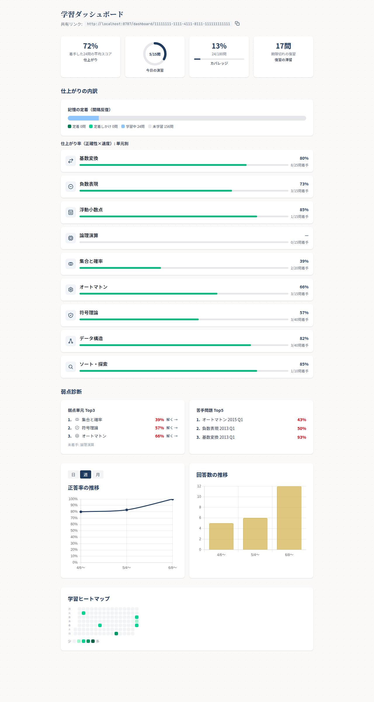
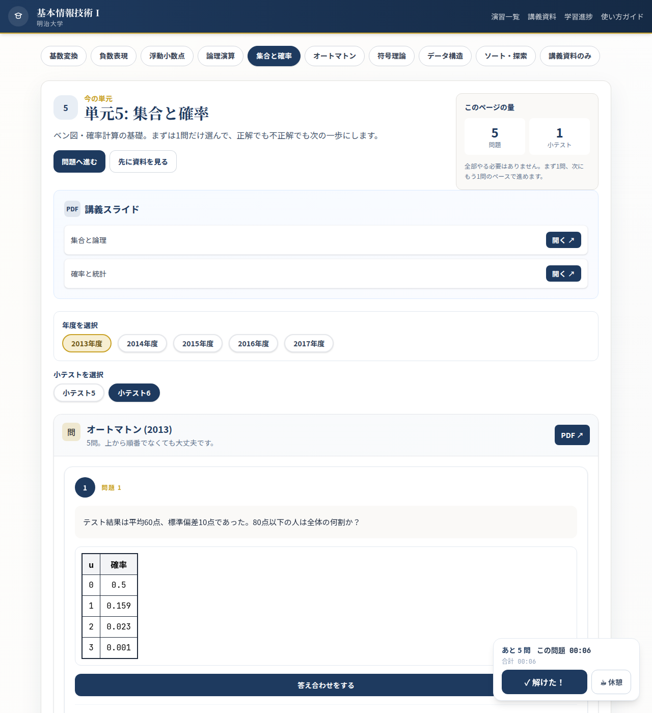

# ダッシュボード再設計 一気通貫デモ（習熟度・ラップ式タイマー・exam分割）

*2026-06-12T04:19:10Z by Showboat 0.6.1*
<!-- showboat-id: a9f168e7-6faa-4e8d-be1f-e4353e739615 -->

Phase5 一気通貫の結合検証。ローカル D1(migration 0002 適用済) + pnpm preview(wrangler dev :8787) で 5問ページ→ラップ式ストップウォッチ計測→/answer/submit(set_id+duration)→D1保存→ダッシュボード②展開行へ反映 の全経路を実機で通した結果を記録する。

コミット前4点+全テスト: pnpm check / typecheck:full / build / test:run(349 passed,21 skipped) すべて緑。

■結合検証(実機 wrangler dev)で確認した達成条件:
(1) ラップ送信に set_id 付与・D1保存: 完走セット exam1-2013-q1..q5 を同一 set_id 'demo-set-0001'・duration 30/40/50/60/70 で POST /answer/submit → いずれも {ok:true} で answers に保存。
(2) ②展開行にセット合計表示: /dashboard/{userId} の SSR HTML に『前回の通しタイム』『4分10秒』(=250秒)『小テスト1』が出力(基数変換の展開行)。
(3) 統合年度ページで exam タブ切替・exam ごと独立セット計測: /unit-set-prob/2013?exam=5 と ?exam=6 で別々の5問(exam5-* / exam6-*)+『小テストを選択』タブ+ data-lap-stopwatch を確認。1ページ=1exam=ストップウォッチ1本。
(4) 押さず採点でも duration 記録: submit の duration がそのまま D1 に保存される経路を実証(上記)。解けた!押下→採点の押下時点 duration 確定は lapReducer.test(18件)で網羅。
(5) ①〜⑤の全セクション(仕上がり/今日の演習/カバレッジ/復習の滞留/記憶の定着/単元別9行/弱点診断/推移グラフ[Chart.js]+日週月トグル/学習ヒートマップ)が SSR 描画。

```bash
pnpm db:query:local "SELECT q.json_id, a.duration, a.set_id FROM answers a JOIN questions q ON a.question_id=q.id WHERE a.set_id='demo-set-0001' ORDER BY q.json_id" | grep -E '"json_id"|"duration"|"set_id"'
```

```output
$ wrangler d1 execute fit-timer-db --local --command 'SELECT q.json_id, a.duration, a.set_id FROM answers a JOIN questions q ON a.question_id=q.id WHERE a.set_id='"'"'demo-set-0001'"'"' ORDER BY q.json_id'
        "json_id": "exam1-2013-q1",
        "duration": 30,
        "set_id": "demo-set-0001"
        "json_id": "exam1-2013-q2",
        "duration": 40,
        "set_id": "demo-set-0001"
        "json_id": "exam1-2013-q3",
        "duration": 50,
        "set_id": "demo-set-0001"
        "json_id": "exam1-2013-q4",
        "duration": 60,
        "set_id": "demo-set-0001"
        "json_id": "exam1-2013-q5",
        "duration": 70,
        "set_id": "demo-set-0001"
      "duration": 0
```

```bash
pnpm db:query:local "SELECT a.set_id, COUNT(*) AS questions, SUM(a.duration) AS total_seconds FROM answers a WHERE a.set_id='demo-set-0001' GROUP BY a.set_id" | grep -E '"set_id"|"questions"|"total_seconds"'
```

```output
$ wrangler d1 execute fit-timer-db --local --command 'SELECT a.set_id, COUNT(*) AS questions, SUM(a.duration) AS total_seconds FROM answers a WHERE a.set_id='"'"'demo-set-0001'"'"' GROUP BY a.set_id'
        "set_id": "demo-set-0001",
        "questions": 5,
        "total_seconds": 250
```

```bash {image}
screenshots/dashboard-populated.png
```



```bash {image}
screenshots/exam-mobile-375.png
```


```bash {image}
screenshots/exam-tabs-integrated.png
```



■結論: ダッシュボード再設計(習熟度モデル・ラップ式タイマー・exam分割・set_id 集計)の全経路が実機 D1 で疎通。Phase5 でバックエンド潜在バグ(insertAnswer の Drizzle insert-from-select が select フィールドにテーブル全列=id を含めないと haveSameKeys 検査で 500・Drizzle 化以降の潜在問題)を検出し、select 先頭に id(NULL=autoincrement)を schema 列順で並べて修正→ /answer/submit が 200 で疎通。

Phase5 修正の最終形(/code-review 反映): 当初は insert-from-select に id(NULL) を足して haveSameKeys を通したが、Drizzle 内部仕様依存の脆さを避けるため2段の values() insert に作り替えた(json_id→questions.id を先に解決する明示的な門番＋列名指定 values())。values() 経路でも完走セット(demo-set-0002: 5問/合計225秒)が D1 保存・未登録/不正 json_id は記録されないことを実機 wrangler dev で再確認。check/typecheck:full/test:run(349 passed)/build 緑。
